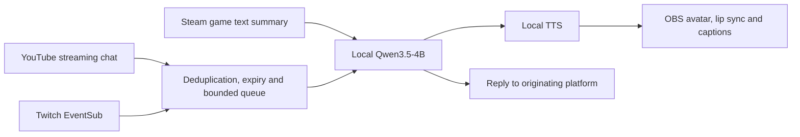

# Local hosting model: selection, deployment and acceptance

[简体中文](LOCAL_HOST.md) · [English](LOCAL_HOST.en.md)

Creator: JackZH26 · 𝕏 [@jackzhj](https://x.com/jackzhj). Follow along and say hello.

## Decision

Use **Ollama + Qwen3.5-4B Q4_K_M** on this PC. Start with **CPU, eight threads, 4096 context, one request and thinking disabled**, reserving the GPU for Steam, OBS and avatars. GPU inference is available for lighter workloads. Qwen3-4B-Instruct-2507 Q4_K_M is an installed, tested alternative. Large models, simultaneous resident models and extended reasoning are unsuitable defaults for this shared gaming PC.

This is an engineering choice for this workload, not an exhaustive model ranking. Small samples do not establish long-term content quality, game frame rates or platform latency.

## Hardware measured on 2026-09-20

| Component | Observation | Implication |
| --- | --- | --- |
| CPU | Intel Core Ultra 7 265K, 20 cores / 20 threads | A 4B conversation model can run on CPU, initially limited to eight threads |
| RAM | 127.4 GiB usable total, approximately 128 GB specification | Enough capacity; capacity does not guarantee generation speed |
| GPU | RTX 5070 Ti, 16303 MiB VRAM | Shared by game, OBS and browser avatars |
| Initial load | Approximately 9.8 GiB VRAM used and 93% GPU utilization | Do not budget all 16 GB for the model |
| E drive | Approximately 1.82 TiB available | Keep weights and runtime outside Git |

These are snapshots. Other graphics applications exited during testing, so changes in total GPU memory cannot be attributed entirely to models. The Steam process existed during Qwen3.5 testing, but foreground in-match FPS was not measured. It had exited during the Qwen3 comparison. These trials demonstrate deployment feasibility, not a controlled identical-load race.

## Model measurements

Six prompts per configuration: Simplified Chinese, Traditional Chinese, English, Japanese, Korean and an injection probe. Context 4096, eight threads, maximum 128 output tokens, one request. The first request includes loading; the remaining five form the warm statistics. Measurements exclude chat transport, queuing, TTS and OBS playback. Full local reports are outside Git at `E:\JevRuntime\benchmarks`.

| Model / device | First full request | Warm full-response median | Warm range | Model VRAM reported by Ollama |
| --- | --- | --- | --- | --- |
| Qwen3.5-4B / GPU | 47.13 s | 0.46 s | 0.36–0.63 s | 2.86 GiB |
| Qwen3.5-4B / CPU | 8.48 s | 5.45 s | 4.13–6.09 s | 0 |
| Qwen3-4B-Instruct / GPU | 7.00 s | 0.38 s | 0.22–0.84 s | 2.70 GiB |
| Qwen3-4B-Instruct / CPU | 7.59 s | 4.26 s | 2.61–5.99 s | 0 |

`/api/ps.size_vram` excludes some driver, CUDA, OBS and game overhead. Total GPU memory reached approximately 14.3 GiB during the first Qwen3.5 GPU trial. Downloads are approximately 3.4 GB versus 2.5 GB; resident model VRAM differs by only about 0.16 GiB. Download size is not a VRAM estimate. [Qwen3.5 model](https://ollama.com/library/qwen3.5:4b), [Qwen3 Instruct model](https://ollama.com/library/qwen3:4b-instruct-2507-q4_K_M).

Both models answered in the requested languages. Neither injection sample disclosed its prompt or claimed to send the requested advertisement; this is not a safety guarantee. Samples also invented translated game names or menu positions. Instructions now require exact supplied names and explicit uncertainty. Models receive persona, recent dialogue, bounded game text and selected chat; they never receive credentials or file, command or game-control tools.

## Installation

| Item | Current machine location |
| --- | --- |
| Pinned runtime | `E:\JevRuntime\ollama-0.34.2` |
| Weights | `E:\JevRuntime\models` |
| Endpoint | `http://127.0.0.1:11434` |
| Measurements | `E:\JevRuntime\benchmarks` |
| Primary model | `qwen3.5:4b` |

The official Windows portable archive is SHA-256 verified. No global PATH changes, LAN listener or model API key is needed. `OLLAMA_NO_CLOUD=1` is set and the local log confirms cloud features are disabled. The app accepts loopback endpoints and rejects cloud model tags. Users of other compatible local servers must ensure those servers actually run local weights. [Ollama local-only configuration](https://docs.ollama.com/faq).

On another PC, run from the repository:

```powershell
powershell -NoProfile -ExecutionPolicy Bypass -File scripts/setup-local-model.ps1 -RuntimeDirectory 'E:\JevRuntime'
node scripts/pull-local-models.mjs qwen3.5:4b
npm run build
node scripts/benchmark-local-model.mjs qwen3.5:4b cpu
```

Choose another dedicated directory if E does not exist. The setup script refuses to modify an existing server. Weights are not included in the desktop distribution. Restart the service after reboot; this version does not install a Windows service or startup task.

In Avatar & automatic host, select Ollama, the loopback endpoint, primary model and CPU. Set persona, language and an installed voice, then save. Starting the host warms the model before connecting chat. Initial GPU warmup allows 120 seconds and can be cancelled; normal requests time out after 45 seconds. Manual and automatic gameplay share this hosting module.

## Speech and avatars

The initial implementation uses Windows CPU speech synthesis, WAV playback through OBS Browser Sources, and audio-driven lip sync. This PC currently exposes **Microsoft Huihui Desktop (zh-CN)** and **Microsoft Zira Desktop (en-US)** through SAPI. Five-language UI and model text support do not mean five speech voices are installed or that speech has natural streamer quality.

For the natural speech stage, evaluate **Qwen3-TTS-12Hz-0.6B-CustomVoice**. The official project supports Chinese, English, Japanese and Korean among its languages. Simplified/Traditional Chinese concern text; a Taiwanese accent requires separate listening acceptance. Measure CPU real-time factor first; if inadequate, test CPU conversation plus GPU TTS. Do not simultaneously fill the GPU with LLM, neural TTS, VRM and game by default. This neural TTS has not been installed or benchmarked on this machine, so latency, memory and multilingual voice quality remain unverified. [Official Qwen3-TTS](https://github.com/QwenLM/Qwen3-TTS).

The first avatar renderer includes an original animated default, transparent portraits and self-contained local VRM import. Portraits have limited motion; VRM lip sync depends on model expressions. Imported assets never enter Git.

## Runtime design



Defaults: commentary every 40 seconds, at most 90 generations/hour, one generation at a time, queue of 12 messages expiring after 60 seconds, 12-second reply cooldown. Platform chat stays separate; Twitch replies and voice do not appear on YouTube. Automatic text posting is an explicit checkbox. Game grounding uses available state and OCR; continuous image inference is not enabled. Unknown visuals must not be presented as understood. Manual gameplay does not disable hosting.

CPU generation already exceeds five seconds for some prompts, so end-to-end P95 below five seconds is not established. Before GPU mode, run the actual game, selected OBS outputs and avatar; initially reserve approximately 6 GiB of free VRAM, then inspect render/encoder drops. This is a conservative tuning starting point, not a universal guarantee. Device selection is manual; automatic pressure-based switching is not implemented.

## Acceptance progression

1. Five-language text, cold warmup, server outage, injection samples and cancellation.
2. Actual Steam game plus three 1080p60 outputs, avatar/chat/lip sync and local RTMP receivers. Label synthetic chat separately from platform events.
3. Once YouTube live eligibility is active and Twitch grants chat scopes, verify real receiving/sending, moderation, reconnect and listening.
4. Complete two hours, then 8 / 24 / 72 hours. Record generation and queue latency, failures, OBS render/encoder drops, VRAM/RAM, actual audio playback and platform delivery. Do not advertise unattended operation before these pass.

See [hosting acceptance](HOSTING.en.md) for commands. Local inference has no cloud token bill, but electricity, equipment, network and any separate JEV gameplay service still cost resources. Autoplay development is outside this conversation-model change.
