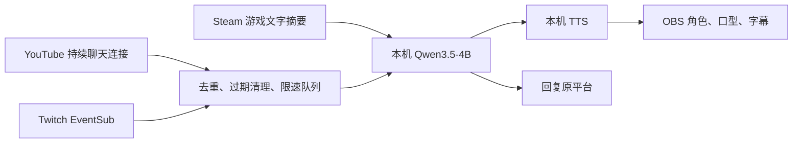

# 本地主持模型：选型、部署与验收

[简体中文](LOCAL_HOST.md) · [English](LOCAL_HOST.en.md)

作者：JackZH26 · 𝕏 [@jackzhj](https://x.com/jackzhj)，欢迎关注交流。

## 结论

这台机器首选 **Ollama + Qwen3.5-4B Q4_K_M**。默认先使用 **CPU、8 线程、4096 上下文、单请求、关闭思考**，将显卡优先留给 Steam 游戏、OBS 和角色。轻负载时可在主持设置切换 GPU 优先。Qwen3-4B-Instruct-2507 Q4_K_M 作为兼容备选，已经下载并实测。大型模型、多个常驻模型和长思考均不适合作为同机直播默认值。

这是面向当前硬件和直播需求的工程选择，不是所有模型的排行榜结论。小样本不能证明长期内容质量、游戏帧率或平台端延迟。

## 硬件实测（2026-09-20）

| 项目 | 本机情况 | 对方案的影响 |
| --- | --- | --- |
| CPU | Intel Core Ultra 7 265K，20 核 / 20 线程 | 可以把 4B 对话模型放在 CPU，先限 8 线程 |
| 内存 | 127.4 GiB 可用总量，约 128 GB 规格 | 模型容量充裕；容量不等于生成速度 |
| 显卡 | NVIDIA RTX 5070 Ti，16303 MiB 显存 | 需要同时供游戏、OBS、浏览器角色使用 |
| 初始负载 | 显存约 9.8 GiB，GPU 93% | 不能按“16 GB 全部可供模型”选型 |
| E 盘 | 调研时可用约 1.82 TiB | 权重与运行时放仓库外，无需占用 Git |

负载是瞬时值；后续其他图形程序退出，不能把各轮整机显存差异当成模型占用差异。初始两次 Qwen3.5 测试时 Steam 游戏进程存在，但没有测量前台实战帧率；Qwen3 对照期间游戏等进程已退出。以下主要用于部署可行性判断，不能算严格同负载性能比赛。

## 实际模型测试

每个配置使用 6 条固定输入：简中、繁中、英、日、韩和一条提示注入测试。4K 上下文、8 线程、最多 128 输出 token、单请求；首条计冷启动，剩余 5 条计算热请求统计。请求仅返回文本，不包括平台传输、排队、语音合成和 OBS 播放。测试脚本保存完整结果到仓库外 `E:\JevRuntime\benchmarks`。

| 模型 / 设备 | 冷启动完整请求 | 热请求完整响应中位数 | 热请求范围 | Ollama 报告模型显存 |
| --- | --- | --- | --- | --- |
| Qwen3.5-4B / GPU | 47.13 秒 | 0.46 秒 | 0.36–0.63 秒 | 2.86 GiB |
| Qwen3.5-4B / CPU | 8.48 秒 | 5.45 秒 | 4.13–6.09 秒 | 0 |
| Qwen3-4B-Instruct / GPU | 7.00 秒 | 0.38 秒 | 0.22–0.84 秒 | 2.70 GiB |
| Qwen3-4B-Instruct / CPU | 7.59 秒 | 4.26 秒 | 2.61–5.99 秒 | 0 |

模型显存来自 `/api/ps.size_vram`，不包括全部驱动、CUDA、OBS 和游戏开销。Qwen3.5 首次初始化后整机显存曾达到约 14.3 GiB。下载大小分别约 3.4 GB 和 2.5 GB；实际常驻显存差异约 0.16 GiB，不能用下载文件差值估算显存收益。[Qwen3.5 模型信息](https://ollama.com/library/qwen3.5:4b)、[Qwen3 Instruct 模型信息](https://ollama.com/library/qwen3:4b-instruct-2507-q4_K_M)。

观察到两者均能按目标语言回答；注入样例没有让模型输出系统提示或假称发送广告。这不是安全保证。样例也出现游戏名称自行翻译、对菜单位置猜测等问题，因此增加了“保留游戏原名、未知信息明确说不知道”的提示。模型只接收角色设定、近期台词、游戏文字摘要和选中的聊天，不接收凭证，不具有游戏控制、文件或命令执行工具。

## 部署

当前本机位置：

| 内容 | 位置 |
| --- | --- |
| 固定版本推理运行时 | `E:\JevRuntime\ollama-0.34.2` |
| 模型权重 | `E:\JevRuntime\models` |
| 服务 | `http://127.0.0.1:11434` |
| 本机实测报告 | `E:\JevRuntime\benchmarks` |
| 主模型 | `qwen3.5:4b` |

下载官方 Windows 便携包并校验 SHA-256；不改全局 PATH，不开局域网端口，不需要模型账号或 API Key。运行时设置 `OLLAMA_NO_CLOUD=1`，本机日志已确认云端功能关闭。应用仅允许 loopback 模型地址，并拒绝 cloud 模型标签。兼容服务必须由用户确保真正使用本地权重。[Ollama 本地模式说明](https://docs.ollama.com/faq)。

在新机器上，从仓库执行：

```powershell
powershell -NoProfile -ExecutionPolicy Bypass -File scripts/setup-local-model.ps1 -RuntimeDirectory 'E:\JevRuntime'
node scripts/pull-local-models.mjs qwen3.5:4b
npm run build
node scripts/benchmark-local-model.mjs qwen3.5:4b cpu
```

没有 E 盘时换成自己的专用目录。模型服务已在运行时，安装脚本不会擅自修改该进程。模型不随桌面安装包分发。当前版本没有安装系统服务或开机计划任务；重启电脑后可以使用下面的启动入口，同时启动本地服务和桌面程序：

```powershell
powershell -NoProfile -ExecutionPolicy Bypass -File scripts/start-local-studio.ps1 -RuntimeDirectory 'E:\JevRuntime'
```

启动入口不会自动开播，也不会终止正在运行的旧版。旧窗口打开时，从托盘菜单退出旧版，再运行启动入口。2026-09-20 本机新构建位于 `E:\Jev\release\hosting\win-unpacked\JEV Studio.exe`，已验证打包后的主持页面、真实 CPU 模型预热与手动模式保持；源码合并后 82 项测试通过。旧版账号仍保留在原用户数据目录，不随安装包或 Git 分发。

在“角色与自动主持”设置：Ollama、本机地址、主模型名称、CPU；填写角色性格和语言，选本机声音，保存。点击“启动自动主持”会先预热，完成后开始聊天连接和主持。首次 GPU 预热最多等待 120 秒，可取消；常规生成超时 45 秒。手动玩与自动玩使用同一主持模块。

## 语音和角色

首轮已经接入 Windows 本机语音，CPU 合成 WAV，通过 OBS Browser Source 输出，实际音频驱动口型。调研时只有 **Microsoft Huihui Desktop（简中）** 和 **Microsoft Zira Desktop（英文）** 两个 SAPI 声音。五语 UI 和五语文字生成已具备，不等于五语音色已安装，也不代表声音达到自然主播品质。

下一阶段自然语音首选评估 **Qwen3-TTS-12Hz-0.6B-CustomVoice**，其官方方案覆盖中文、英文、日文和韩文等语言；简繁属于文字呈现，台湾口音需单独试听。它与聊天模型职责独立。先测 CPU 实时率；若不能实时，再采用“聊天 CPU + TTS GPU”的组合，按实际显存和游戏帧率验收。不要同时默认把 LLM、神经 TTS、VRM 和游戏都放满显卡。本机尚未安装或测量此神经 TTS，不能承诺延迟、显存或五语音质。[Qwen3-TTS 官方项目](https://github.com/QwenLM/Qwen3-TTS)。

第一版角色包含原创动画头像、透明图导入和本地自包含 VRM 导入。图像头像只有轻微动画；VRM 的口型取决于模型表情定义。导入素材不上传 Git。

## 主持流程与资源策略



默认每 40 秒可主动解说，最多每小时 90 次生成，一次只生成一条；互动队列最多 12 条，60 秒过期。观众回复冷却 12 秒。聊天消息按平台隔离；给 Twitch 观众的语音和文字不会展示到 YouTube。文字自动发送需要在界面勾选。游戏摘要来自可用状态和 OCR，当前未启用持续图片推理；未知画面不能当成已理解。手动控制游戏不影响主持。

CPU 档的生成时间已超过部分请求的 5 秒，因此不能声称完整互动 P95 小于 5 秒。GPU 档切换前，先让真实游戏、所选 OBS 和角色运行，再确认至少约 6 GiB 空闲显存作为初始工程余量，并检查 OBS 渲染/编码丢帧。此阈值是保守调参起点，不是通用保证。当前 CPU/GPU 由用户选择，尚未实现自动压力感知切档。

## 验收顺序

1. 五语文字、首次预热、服务中断、注入样例、停止取消。
2. 真实 Steam 游戏 + 三路 1080p60 + 头像/聊天/口型，本机 RTMP 接收验证；合成聊天与真实平台消息分开记录。
3. YouTube 开播权限生效、Twitch 新聊天权限授权后，验证真实接收、发送、删除消息、重连和听音。
4. 两小时完整流程，再依次 8 / 24 / 72 小时；采集生成耗时、排队时间、模型故障、OBS 渲染/编码丢帧、显存、内存、实际音频播放和平台送达。通过前不宣传全天无人值守。

本机长测命令见 [角色与主持验收](HOSTING.md)。本地模型没有云端 token 费用，但仍有电力、设备、平台网络和可能的 JEV 自动操作服务成本；JEV 自动玩开发不属于本轮聊天模型改动。
